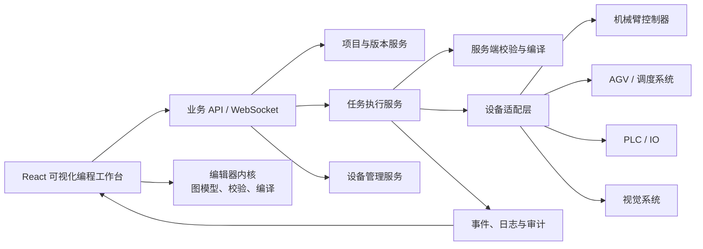
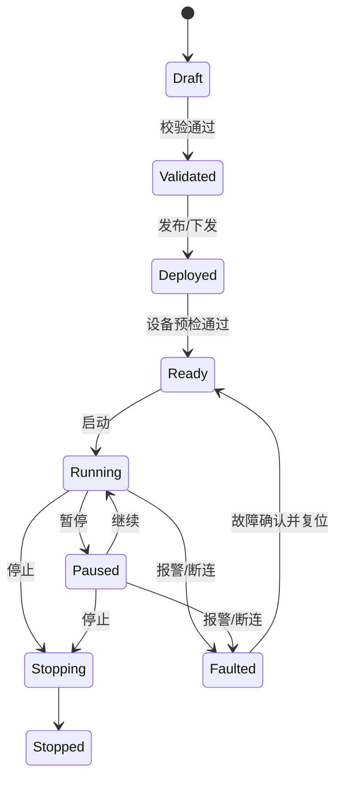

# 工业机器人可视化编程工具深度集成方案

## 1. 结论

建议不要通过 `iframe` 或直接复制整页 HTML 的方式接入，而是采用“保留 LiteGraph 编辑能力、重构为 React/TypeScript 模块、后端承接项目管理与编译执行、设备适配层隔离厂商协议”的深度集成路线。

最终应形成一条完整链路：

> 设备建模 → 节点编排 → 静态校验 → Lua/中间表示生成 → 仿真或试运行 → 审批发布 → 控制器执行 → 实时状态回传 → 日志与版本追溯

当前两个项目已经具备很好的互补性：

- `D:\robot\frontend` 已经有 React、路由、权限入口、设备控制、状态日志和流程菜单。
- `node-editor-v2.html` 已经有较成熟的 LiteGraph 节点编辑、Lua 生成、流程校验、变量、多子流程、自定义节点、导入导出、撤销重做等能力。
- 当前缺口主要在工程化、服务端持久化、真实设备协议、运行态、安全控制、权限审计和测试。

推荐先完成编辑器模块化迁移，再建设后端与设备执行链路。这样可以尽快获得可用界面，同时避免把原型中的全局变量、`localStorage` 和动态脚本能力直接带入生产系统。

---

## 2. 现状评估

### 2.1 现有 React 项目

现有项目为 React 18 + TypeScript + Vite，主要使用：

- Ant Design：管理界面组件。
- React Router：页面与权限路由。
- Zustand：机械臂、AGV、日志和认证状态。
- `@xyflow/react`：当前简化版流程编辑器。
- Axios：预留 HTTP 通信能力。

现有页面已经包含：

- 登录与受保护路由。
- 设备列表、机械臂控制、AGV 控制。
- 流程编排与可视化编程入口。
- 状态日志与设置页面。

但目前设备连接、运动、登录、流程运行等多数能力是前端模拟；流程仅保存到 `localStorage`，启动、暂停、停止也没有连接真实执行服务。

### 2.2 待集成的节点编辑器

桌面目录中的节点编辑器是一个约 130 KB 的单页应用，依赖 LiteGraph，主要能力包括：

- 流程节点、机械臂、法奥机械臂、PLC、相机、AGV、变量、工具和数学节点。
- 执行流与数据流端口。
- 条件、循环、跳出、返回、子流程调用。
- 节点参数源、属性编辑、禁用和备注。
- 多工作流、变量池、自定义节点库。
- Lua 代码生成、语法预览和下载。
- 图校验、搜索、缩略图、自动布局、导入导出、撤销重做。

目前存在以下生产化问题：

1. HTML、CSS、节点定义、编译逻辑和状态管理全部位于单个文件。
2. 使用大量全局变量和直接 DOM 操作，无法自然接入 React 生命周期。
3. 流程、自定义节点和变量均保存在浏览器 `localStorage`，无法多人协作、审计和版本管理。
4. “运行”只生成或下载 Lua，并没有可靠的上传、执行、暂停、终止与状态回传协议。
5. 自定义 Lua 方法和脚本可由用户编辑，若直接下发会形成远程代码执行风险。
6. 数据端口目前基本允许任意类型互连，生产环境需要严格类型系统。
7. 项目导入仅做 JSON 解析，缺少 Schema 校验、版本迁移、大小限制与恶意内容过滤。
8. 当前撤销栈只覆盖正在编辑的单个图，没有形成项目级变更历史。
9. 未建立设备、工位、坐标系、工具、点位和节点参数之间的统一资源引用。

### 2.3 两套编辑器的处理建议

现有 React 项目中的 `@xyflow/react` 编辑器只具备基础节点拖放、连接和模拟运行能力；LiteGraph 原型的工业节点能力明显更完整。

建议：

- 可视化编程页面统一采用 LiteGraph，不同时维护两套图模型。
- `@xyflow/react` 可暂时保留给“工艺级流程编排”，但必须明确职责：
  - 工艺编排：描述任务、工位、设备间的高层调度。
  - 机器人编程：描述单台或多台设备的具体运动、IO、判断、循环和 Lua 指令。
- 如果短期内不需要两级编排，则直接移除重复页面，将 `/flow/process` 重定向到统一的项目工作台。

---

## 3. 目标架构



### 3.1 前端分层

建议目录：

```text
frontend/src/features/visual-programming/
├─ pages/
│  └─ VisualProgrammingPage.tsx
├─ components/
│  ├─ EditorShell.tsx
│  ├─ NodePalette.tsx
│  ├─ GraphCanvas.tsx
│  ├─ PropertyPanel.tsx
│  ├─ CodePreview.tsx
│  ├─ ValidationPanel.tsx
│  ├─ WorkflowTabs.tsx
│  └─ RuntimeConsole.tsx
├─ core/
│  ├─ graph/
│  │  ├─ GraphEngine.ts
│  │  ├─ GraphSerializer.ts
│  │  └─ GraphMigration.ts
│  ├─ registry/
│  │  ├─ NodeRegistry.ts
│  │  └─ nodeDefinitions/
│  ├─ validation/
│  │  ├─ GraphValidator.ts
│  │  └─ rules/
│  └─ compiler/
│     ├─ WorkflowIR.ts
│     ├─ IRBuilder.ts
│     └─ LuaGenerator.ts
├─ stores/
│  ├─ projectStore.ts
│  ├─ editorStore.ts
│  └─ runtimeStore.ts
├─ services/
│  ├─ projectApi.ts
│  ├─ compileApi.ts
│  └─ runtimeSocket.ts
├─ schemas/
│  ├─ project.schema.ts
│  └─ node.schema.ts
└─ types/
   ├─ project.ts
   ├─ node.ts
   └─ runtime.ts
```

关键约束：

- React 管理页面布局和业务状态，LiteGraph 只管理画布与交互。
- 用 `useEffect` 初始化和销毁 `LGraph`、`LGraphCanvas`，禁止把实例放入可序列化 Zustand 状态。
- 节点定义采用声明式配置，UI、端口、校验、编译规则由同一份定义生成。
- 编译器、校验器和迁移器保持纯函数，便于单元测试及未来迁移到 Web Worker。
- 大型图的校验、生成和自动布局放入 Web Worker，避免阻塞页面。

### 3.2 后端分层

当前仓库没有后端。建议新增独立服务，技术栈可根据团队能力选择：

- 推荐：Java Spring Boot，适合工业系统的权限、审计、事务和长周期维护。
- 备选：Node.js + NestJS，前后端共享 TypeScript 类型，开发速度更快。

后端模块：

```text
server/
├─ auth              用户、角色、权限、令牌
├─ project           项目、工作流、变量、资源引用
├─ version           草稿、快照、发布版本、回滚
├─ compiler          Schema 校验、IR 校验、Lua 生成
├─ runtime           任务状态机、控制命令、断线恢复
├─ device            设备、能力、连接与健康状态
├─ adapter           法奥/其他机械臂、PLC、AGV、视觉适配器
├─ telemetry         实时状态、节点事件、报警
└─ audit             操作审计、执行记录、代码摘要
```

### 3.3 设备适配层

不能让节点直接绑定某厂商 SDK。节点应表达通用能力，例如：

- `robot.connect`
- `robot.setMode`
- `robot.moveJ`
- `robot.moveL`
- `robot.setIO`
- `robot.getPose`
- `agv.moveTo`
- `plc.writeRegister`
- `vision.locate`

设备适配器负责把通用命令转换为：

- 法奥 Lua 或 SDK 调用。
- 其他厂商机器人脚本或 API。
- Modbus TCP/RTU。
- AGV 调度系统 HTTP/MQTT/ROS 接口。
- 视觉系统 TCP/HTTP 接口。

节点只引用 `deviceId` 和能力，不保存 IP、端口、密码。设备连接信息只能保存在后端加密配置中。

---

## 4. 核心数据模型

### 4.1 项目模型

建议在现有导出格式 `version: 3` 基础上定义正式 Schema：

```ts
interface RobotProgramProject {
  schemaVersion: '1.0';
  id: string;
  name: string;
  description?: string;
  robotModelId?: string;
  entryWorkflowId: string;
  workflows: WorkflowDocument[];
  variables: VariableDefinition[];
  resourceRefs: ResourceReference[];
  nodeLibraryVersion: string;
  revision: number;
  status: 'draft' | 'reviewing' | 'published' | 'archived';
  createdBy: string;
  updatedBy: string;
  createdAt: string;
  updatedAt: string;
}
```

### 4.2 工作流与节点

```ts
interface WorkflowDocument {
  id: string;
  name: string;
  kind: 'main' | 'subflow';
  graph: {
    nodes: ProgramNode[];
    links: ProgramLink[];
    viewport?: { x: number; y: number; zoom: number };
  };
}

interface ProgramNode {
  id: string;
  type: string;
  definitionVersion: string;
  position: [number, number];
  properties: Record<string, unknown>;
  parameterSources: Record<string, ParameterSource>;
  disabled?: boolean;
  annotation?: string;
}
```

节点 ID 必须改为稳定 UUID。节点类型需要携带定义版本，升级节点库时由迁移器负责兼容。

### 4.3 工业资源模型

流程参数不应大量保存自由文本，而应引用资源：

- 设备：`deviceId`
- 机械臂点位：`pointId`
- 工具坐标系：`toolFrameId`
- 工件坐标系：`workFrameId`
- AGV 工位：`stationId`
- PLC 标签：`tagId`
- 视觉任务：`visionJobId`

例如 PTP 节点不再直接保存 `"{0,0,0,0,0,0}"`，而是保存点位引用和可选覆盖参数。这样点位示教、设备状态和程序执行才能共享同一份数据。

---

## 5. 编译与校验设计

### 5.1 不建议从画布直接拼接 Lua

推荐编译链路：

```text
LiteGraph JSON
  → Schema 校验
  → 图语义校验
  → 统一中间表示 IR
  → 设备能力校验
  → 安全策略校验
  → 厂商代码生成
  → 代码格式化与摘要
```

建立 IR 可以避免业务逻辑长期绑定 Lua，也能支持后续生成其他厂商语言或直接执行通用命令。

### 5.2 必需校验

前端即时校验与服务端权威校验应使用一致规则，但以服务端结果为准。

结构校验：

- 主流程必须且只能有一个入口。
- 不允许悬空执行节点。
- 子流程引用必须存在，不允许非法递归。
- 循环跳出和继续只能出现在循环体中。
- 条件分支必须覆盖合法出口。
- 数据端口严格校验类型与可转换规则。
- 所有必填参数和资源引用必须存在。

设备与运动校验：

- 节点能力必须被目标设备支持。
- 关节角、速度、加速度、负载和工作空间不得越界。
- 点位使用的工具和工件坐标系必须一致。
- 自动模式、使能、急停、安全门状态必须满足执行条件。
- 多机器人共享区域必须有互锁或资源锁。
- PLC 地址与数据类型必须匹配已配置标签。

发布校验：

- 服务端重新生成代码，不能信任浏览器上传的 Lua。
- 生成物记录 SHA-256、节点库版本、编译器版本和项目版本。
- 自定义脚本默认禁止发布；如确需开放，必须使用白名单 API、静态扫描和审批权限。

---

## 6. 运行与实时反馈

### 6.1 运行状态机



“急停”不应作为普通流程节点或普通 HTTP 按钮处理。急停必须优先依赖安全 PLC 或硬件安全回路；软件只能发送受控停止请求，并清楚区分：

- 暂停：可恢复。
- 正常停止：受控减速并退出。
- 保护停止：安全条件触发。
- 急停：硬件安全链路触发。

### 6.2 WebSocket 事件

前端通过 WebSocket 或 SSE 接收：

```ts
type RuntimeEvent =
  | { type: 'task.state'; taskId: string; state: RuntimeState }
  | { type: 'node.started'; taskId: string; nodeId: string; at: string }
  | { type: 'node.completed'; taskId: string; nodeId: string; durationMs: number }
  | { type: 'node.failed'; taskId: string; nodeId: string; error: RuntimeError }
  | { type: 'device.telemetry'; deviceId: string; payload: unknown }
  | { type: 'alarm.raised'; alarm: Alarm }
  | { type: 'log.appended'; entry: RuntimeLog };
```

编辑器根据 `nodeId` 高亮当前运行节点，并显示断点、耗时、输入输出值和错误定位。

断线重连后，客户端必须通过 `taskId + lastEventSequence` 补拉状态，不能靠前端自行推断任务是否仍在运行。

---

## 7. API 初稿

### 7.1 项目与版本

| 方法 | 路径 | 用途 |
|---|---|---|
| `GET` | `/api/program-projects` | 项目列表 |
| `POST` | `/api/program-projects` | 新建项目 |
| `GET` | `/api/program-projects/{id}` | 获取项目草稿 |
| `PUT` | `/api/program-projects/{id}` | 乐观锁保存草稿 |
| `POST` | `/api/program-projects/{id}/validate` | 权威校验 |
| `POST` | `/api/program-projects/{id}/compile` | 生成预览代码 |
| `POST` | `/api/program-projects/{id}/versions` | 创建版本 |
| `POST` | `/api/program-projects/{id}/publish` | 审批后发布 |
| `GET` | `/api/program-projects/{id}/versions` | 版本历史 |
| `POST` | `/api/program-projects/{id}/versions/{version}/restore` | 回滚为新草稿 |

保存接口使用 `revision` 或 `ETag/If-Match`，避免多人编辑时静默覆盖。

### 7.2 执行任务

| 方法 | 路径 | 用途 |
|---|---|---|
| `POST` | `/api/runtime/tasks` | 基于已发布版本创建任务 |
| `POST` | `/api/runtime/tasks/{id}/preflight` | 设备与安全预检 |
| `POST` | `/api/runtime/tasks/{id}/start` | 启动 |
| `POST` | `/api/runtime/tasks/{id}/pause` | 暂停 |
| `POST` | `/api/runtime/tasks/{id}/resume` | 继续 |
| `POST` | `/api/runtime/tasks/{id}/stop` | 受控停止 |
| `GET` | `/api/runtime/tasks/{id}` | 获取任务状态 |
| `GET` | `/api/runtime/tasks/{id}/logs` | 获取日志 |
| `WS` | `/ws/runtime` | 实时事件 |

所有改变运行状态的接口都应支持幂等键，并记录用户、设备、项目版本、时间和结果。

### 7.3 设备资源

| 方法 | 路径 | 用途 |
|---|---|---|
| `GET` | `/api/devices` | 设备与能力列表 |
| `GET` | `/api/devices/{id}/capabilities` | 可用节点能力 |
| `GET` | `/api/devices/{id}/telemetry` | 当前状态 |
| `GET` | `/api/robot-points` | 点位列表 |
| `POST` | `/api/robot-points/capture` | 从当前姿态示教点位 |
| `GET` | `/api/stations` | AGV 工位 |
| `GET` | `/api/plc-tags` | PLC 标签 |
| `GET` | `/api/vision-jobs` | 视觉任务 |

---

## 8. 前端页面融合

### 8.1 页面布局

建议将 `/flow/program` 设计为全高度工作台：

- 顶部：项目选择、版本、保存状态、校验、仿真、发布、运行控制。
- 左侧：节点库、变量、设备资源、点位与子流程。
- 中间：LiteGraph 画布、搜索、缩略图。
- 右侧：节点属性、校验问题、Lua/IR 预览。
- 底部：运行日志、报警、节点输入输出和任务状态。

为保证画布空间，进入该页面后可折叠主导航侧栏；不要把原型中的第二套品牌头部嵌进现有主布局。

### 8.2 与设备控制页联动

- 设备列表是节点设备选择器的数据源。
- 机械臂当前姿态可一键保存为点位，再在运动节点中引用。
- AGV 工位与流程节点使用同一套 `stationId`。
- 设备离线、未使能或模式不正确时，在编辑器顶部显示预检问题。
- 从运行节点可跳转到对应设备状态页。
- 从设备状态页可查看正在使用该设备的任务。

### 8.3 与日志页联动

统一日志结构，不再由各页面各自模拟：

- 业务操作日志。
- 编译日志。
- 任务运行日志。
- 设备通信日志。
- 报警与确认记录。
- 审计日志。

日志必须携带 `projectId`、`versionId`、`taskId`、`nodeId` 和 `deviceId` 等可选关联键，支持从画布节点追踪到真实执行记录。

---

## 9. 权限与安全

建议最少划分以下角色：

| 角色 | 主要权限 |
|---|---|
| 查看者 | 查看项目、版本、代码和日志 |
| 编程员 | 编辑草稿、校验、仿真 |
| 调试员 | 手动控制设备、低速试运行、单步 |
| 发布审批人 | 审核并发布版本 |
| 操作员 | 运行已发布程序、暂停、停止 |
| 管理员 | 用户、设备、节点库和系统配置 |

生产要求：

- 登录改为服务端认证，令牌不只保存在内存模拟 Store。
- 项目编辑权限与设备操作权限分离。
- 禁止普通用户修改节点的底层方法名和 Lua 模板。
- 自定义节点只能由管理员从受签名节点包安装。
- 生产执行只能选择已发布且校验通过的不可变版本。
- 所有启动、停止、发布、回滚、示教和参数修改都写审计日志。
- API 全部校验参数；前端校验不能代替服务端校验。
- 设备凭据加密存储，不下发浏览器。
- 设定速度上限、软限位、工作区和共享区互锁。
- 单步和试运行默认使用低速限制，并要求设备处于允许的调试模式。

---

## 10. 分阶段实施

### 阶段 0：领域确认与接口盘点（3～5 人日）

目标：

- 确认机械臂厂商、控制器版本、Lua/API 文档。
- 确认 AGV、PLC、视觉通信协议。
- 定义点位、坐标系、工具、工位和设备能力模型。
- 确认“流程编排”和“可视化编程”是否保留两层。
- 确认后端技术栈与部署环境。

输出：

- 设备能力矩阵。
- 节点清单及参数表。
- 协议时序图。
- 安全边界与权限矩阵。

### 阶段 1：编辑器模块化迁移（10～15 人日）

目标：

- 安装并以模块方式引入 `litegraph.js`。
- 把单页拆为 React 组件、节点注册表、校验器和 Lua 生成器。
- 将原型项目格式迁移为正式 TypeScript Schema。
- 接入现有路由、Ant Design 主题和日志体验。
- 保留多流程、变量、自定义节点读取、导入导出、撤销重做等能力。

验收：

- 原型主要节点可创建、配置、连线、保存、重新打开。
- 同一测试项目生成的 Lua 与原型语义一致。
- 页面切换无重复初始化和事件泄漏。
- `npm run build`、单元测试和关键交互测试通过。

### 阶段 2：项目、版本与节点库服务（10～15 人日）

目标：

- 建设服务端项目 CRUD、版本、乐观锁、发布和回滚。
- 建立节点定义与设备能力 API。
- `localStorage` 只用于未提交草稿缓存，不再作为正式数据源。
- 导入原型 `version: 3` JSON，并转换为新 Schema。

验收：

- 可跨浏览器打开同一项目。
- 可查看版本差异、发布和回滚。
- 多人同时保存时能够提示冲突。
- 所有修改有用户与时间记录。

### 阶段 3：设备适配与运行闭环（15～25 人日）

目标：

- 建设任务状态机和 WebSocket 事件。
- 接入第一种机械臂与现有设备页。
- 实现编译、上传、启动、暂停、恢复、受控停止。
- 运行节点高亮、错误定位、遥测与日志关联。
- 实现预检、速度限制、模式检查和设备占用锁。

验收：

- 在仿真器和真机上执行同一套基础流程。
- 网络断开后任务状态可恢复。
- 重复请求不会重复启动任务。
- 故障能定位到项目版本、节点和设备。

### 阶段 4：多设备与生产化（15～30 人日）

目标：

- 接入 AGV、PLC、视觉和第二种机械臂。
- 建立共享区域互锁、资源锁和工艺级编排。
- 增加审批、细粒度权限、监控告警和部署运维。
- 完成性能、稳定性、安全与异常恢复测试。

整体首个可用版本约 38～60 人日；覆盖多设备和生产安全的完整版本约 55～90 人日。该估算不包含厂商 SDK 严重不完整、现场协议改造和安全 PLC 硬件改造。

---

## 11. 测试策略

### 11.1 前端与编译器

- 节点定义 Schema 测试。
- 每类节点的 IR 和 Lua 快照测试。
- 条件、循环、子流程、变量和表达式组合测试。
- 图校验规则测试。
- 旧版 JSON 迁移测试。
- Playwright 覆盖拖放、连线、保存、回滚、校验和运行控制。

### 11.2 后端

- API 权限、幂等、并发版本冲突测试。
- 任务状态机属性测试。
- WebSocket 重连和事件补发测试。
- 设备适配器契约测试。
- 编译产物摘要和不可变版本测试。

### 11.3 现场与安全

- 仿真器 → 台架 → 低速真机 → 正常速度分级验证。
- 断网、断电、设备离线、急停、安全门、PLC 故障测试。
- 越界点位、错误坐标系、设备被占用、程序超时测试。
- 多设备共享区域冲突测试。
- 停止后恢复与人工确认流程测试。

---

## 12. 主要风险与处理

| 风险 | 影响 | 处理 |
|---|---|---|
| 直接把单页嵌入 React | 状态割裂、样式冲突、难测试 | 仅作为短期演示；正式版本模块化迁移 |
| 同时维护 LiteGraph 和 React Flow | 两套图模型长期漂移 | 明确两级编排，或统一为 LiteGraph |
| 浏览器直接生成并下发 Lua | 可篡改、不可审计 | 服务端权威校验和生成 |
| 开放任意自定义脚本 | 远程代码执行 | 白名单节点包、签名、静态扫描、审批 |
| 节点绑定厂商 API | 无法复用与切换设备 | 通用能力节点 + 厂商适配器 |
| 仅靠软件急停 | 不满足工业安全 | 硬件安全回路优先，软件仅做受控停止 |
| `localStorage` 作为数据库 | 丢失、冲突、无审计 | 服务端项目与版本管理 |
| 任意数据端口互连 | 运行期错误 | 严格类型系统与显式转换节点 |
| 直接覆盖现有页面 | 破坏已有交互和用户修改 | 新模块并行接入，逐项迁移与回归 |

---

## 13. 建议立即执行的第一批任务

1. 冻结 `node-editor-v2.html` 为原型基线，并准备 5～10 个代表性项目 JSON 与对应 Lua 作为回归样例。
2. 在 React 项目安装 `litegraph.js`，建立 `GraphCanvas` 适配组件，验证创建、销毁、缩放和路由切换。
3. 抽取 `NodeDefinition`、`ProgramProject`、`WorkflowIR` 三个核心模型。
4. 将节点注册、校验和 Lua 生成从 HTML 中移入独立 TypeScript 模块。
5. 先支持流程控制、通用机械臂、AGV、变量和工具五类核心节点。
6. 建立旧 `version: 3` 项目导入器，保证原型数据可迁移。
7. 选定后端技术栈，实现项目保存、版本和服务端校验最小闭环。
8. 用模拟设备适配器贯通“发布 → 启动 → 节点高亮 → 日志 → 停止”。
9. 再接入第一台真实机械臂，并在低速、隔离环境中验证。

---

## 14. 需要在实施前确认的问题

以下信息会影响阶段 3、4 的设计，但不阻碍先进行编辑器迁移：

1. 目标机械臂具体品牌、型号、控制器版本和 SDK/Lua 文档。
2. Lua 是在机器人控制器、工控机还是当前平台服务端执行。
3. AGV 使用自有 TCP、厂商调度系统、MQTT、ROS 还是其他接口。
4. PLC 型号、协议和地址表是否已经确定。
5. 是否需要离线编程、三维仿真、碰撞检测和轨迹预览。
6. 是否需要多人协同编辑，还是仅需多人查看与版本锁定。
7. 是否存在“编程员—审批人—操作员”分权要求。
8. 现有系统计划部署在 Windows 工控机、Linux 服务器还是私有云。

在这些问题没有全部确定前，建议把一期范围限定为：

> 单用户编辑 + 服务端项目版本 + 服务端校验编译 + 模拟执行 + 第一种机械臂低速真机闭环。

这个范围最容易控制风险，也能尽快验证架构是否适合现场。
